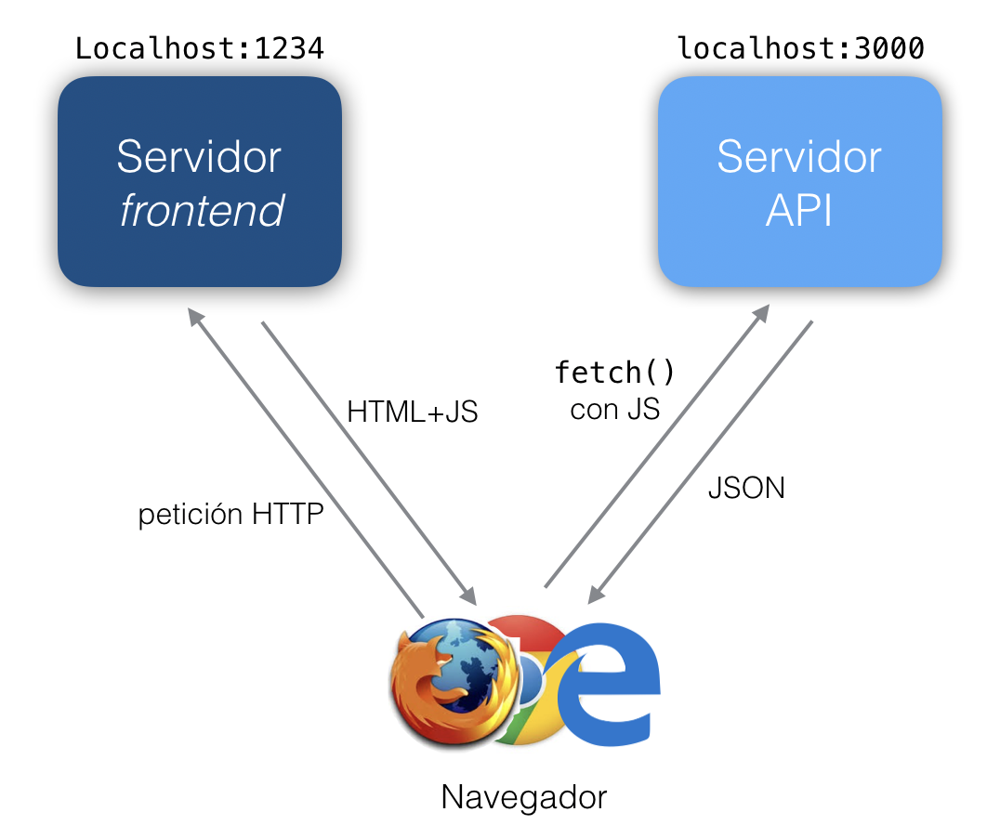

# Estructura del proyecto

Una vez terminada esta práctica tendréis dos servidores en funcionamiento:

- El servidor del API, que corre en el puerto 3000.
- El servidor del *frontend* que vais a implementar en esta práctica. Usaremos de momento un servidor de desarrollo que correrá por el puerto 1234.

Un usuario final se conectaría al servidor del *frontend*. El código JS que contiene el *frontend* hará peticiones REST al servidor del API.



Como las peticiones que van del *frontend* al API se hacen con Javascript desde el navegador, necesitamos que el servidor del API implemente CORS para que el navegador se "salte" la política de seguridad del "mismo origen". En caso contrario el JS solo podría hacer peticiones al servidor del *frontend* pero no al del API.

## Modificación del código del servidor de API

Para añadir soporte de CORS al servidor del API lo más sencillo es usar un paquete `npm` que lo implemente, por ejemplo el paquete `cors`

1. En el proyecto de la práctica anterior instalar el paquete `cors` con 

    ```bash
    npm install cors
    ```

2. En el código principal añadir:

    ```javascript
    var cors = require('cors')
    //Suponiendo "app" la variable obtenida como app=express()
    app.use(cors())
    ```

## Creación del proyecto cliente

En el desarrollo usaremos un *bundler*, que es una herramienta que nos permitirá usar módulos ES6 aunque el navegador no los soporte. También podremos usar otras funcionalidades de JS todavía no implementadas en los navegadores actuales, ya que el *bundler* traducirá el código a la versión ES5 con la ayuda de un *transpilador* (normalmente Babel).

Además los *bundler* suelen ofrecer otras funcionalidades adicionales como importar CSS como si fueran módulos JS o minificar automáticamente el código para la versión de producción.

Actualmente el *bundler* más difundido es [Webpack](https://webpack.js.org), pero es conocido por necesitar una configuración "complicadilla", así que en nuestro caso usaremos [Parcel](https://parceljs.org) cuya configuración es especialmente sencilla.

Lo primero es inicializar el proyecto cliente e instalar Parcel en él:

```bash
mkdir cliente_js_estandar
cd cliente_js_estandar
npm init -y #creará un package.json con valores por defecto
npm install parcel-bundler
```

