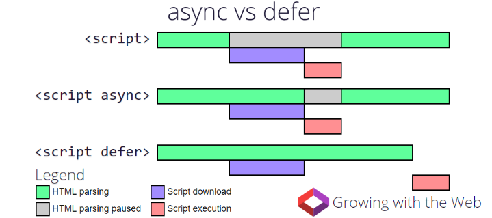
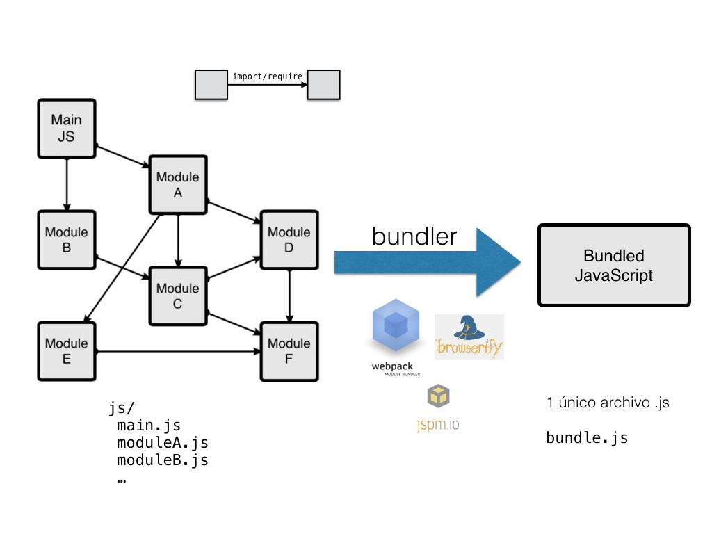

<!-- .slide: class="titulo" -->

# Tema 2: Desarrollo en el cliente con Javascript estándar 
## Parte 1: Introducción. Eventos. Programación de la interfaz


---

<!-- .slide: class="titulo" -->

## 2.1 
## Javascript en el cliente: conceptos básicos

---

## Versiones de JS en el navegador


- Los navegadores actuales implementan [**casi en su totalidad**](http://kangax.github.io/compat-table/es6/) la versión 6 de JS (también llamada **ES6**, o ES2015)
- No obstante **hay funcionalidades importantes todavía no soportadas en algunos navegadores**, y además los nuevos estándares (ES2016, ES2017, ...) siempre "van más rápido" que las implementaciones


---

## Transpilación

- Como solución, se pueden usar compiladores (*[transpiladores](https://en.wikipedia.org/wiki/Source-to-source_compiler)*) que **traduzcan de las versiones nuevas de Javascript a, por ejemplo, ES5**  (sí soportado al 100% nativamente). 
- El transpilador más usado actualmente es [**Babel**](https://babeljs.io/)
- Para el caso ES6->ES5 cada vez es más superfluo usar un transpilador, por haber un soporte nativo amplio de ES6, pero se sigue usando para dar soporte a navegadores *legacy* y para poder emplear funcionalidades >ES6 

---


Babel lo empezó a escribir Sebastian McKenzie a los 17 años mientras estaba en el instituto (ahora trabaja en Facebook). El propio Sebastian cuenta la historia de esta época [aquí](https://medium.com/@sebmck/2015-in-review-51ac7035e272#.1vfchy3bc) 

---

## Insertar JS en el HTML

- En etiquetas `<script>`
- El ámbito de las variables y funciones definidas es la *página*. Pero las definiciones no se pueden compartir entre páginas
- Por defecto el JS se *parsea* y ejecuta conforme se va leyendo

```html
<html>
<head>
  <script>   
    //esto define la función pero no la llama todavía
    function ahora() {            
       var h = new Date();    
       return h.toLocaleString(); }
    var verFecha = true;
   </script>
   <!-- podemos cargar JS externo con un tag vacío y su URL en el src -->
   <script src="otroscript.js"></script>
</head>
<body>
   <script>
      //la variable es visible por estar definida antes en la misma página
      if (verFecha)
        alert("Fecha y hora: " + ahora());
   </script>
</body>
</html>
```

---

## Carga de *scripts* externos

Forma "clásica": con el atributo `src` en un `<script>` vacío conseguimos una especie de "include" 

```html
<!-- Ejemplo funcionando en https://jsbin.com/jaxupiy/edit?html,output -->
<script src="https://maps.google.com/maps/api/js"></script>
<div id="map" style="height:300px;width:400px"></div>
<script>
     map = new google.maps.Map(document.getElementById('map'), {
          center: {lat: 38.385, lng: -0.513},
          zoom: 15
        });
</script>
```
Cuantas más dependencias externas tenemos, esta forma se vuelve más tediosa (por la cantidad de `script src`) y problemática (por tener que gestionar manualmente el orden de las dependencias, si hay relaciones entre ellas)

---

Por defecto al encontrar un *script* se interrumpe la carga del HTML hasta que se acabe de cargar,*parsear* y ejecutar el *script*. Por ello típicamente se recomendaba *colocar los scripts al final*, así el usuario no ve una página en blanco. 

Con *scripts* externos podemos usar los atributos `defer` o `async` 

[https://www.growingwiththeweb.com/2014/02/async-vs-defer-attributes.html](https://www.growingwiththeweb.com/2014/02/async-vs-defer-attributes.html)
<!-- .element class="caption"-->



---

## Módulos en JS

Claramente, los `<script src="">` no son una buena solución al **problema de la modularidad**, ya que lo único que estamos haciendo es juntar todo el código en un "espacio global".

En JS han ido surgiendo distintos sistemas de módulos, algunos estándares oficiales y otros "de facto"

- **CommonJS** (usado en Node)
- **Módulos ES6** (diseñados para los navegadores)  
- AMD: permite la carga asíncrona de módulos
- UMD: compatibiliza AMD y CommonJS


---

## Módulos ES6

JAVASCRIPT:

```javascript
//archivo modulo_saludo.js
function saludar(nombre) {
  return "Hola qué tal, " +  nombre
}
export {saludar}
```

```javascript
//archivo main.js
import {saludar} from './modulo_saludo.js'
console.log(saludar('Pepe'))
```

HTML:

```html
<script type="module" src="main.js"></script>
```


---

## Un problema de los módulos ES6 

- Aunque a fecha de hoy (octubre 2018) la mayoría de navegadores [los implementan](https://caniuse.com/#search=modules), esto es relativamente reciente.
- Antes de esto, a alguien se le ocurrió la idea de añadir "soporte" CommonJS al navegador mediante una herramienta llamada *bundler*
- Como resultado, desde hace unos años **muchas dependencias de terceros se distribuyen** con `npm`, **en** formato **CommonJS** (no soportado nativamente por los navegadores). Es decir, podríamos [usar módulos ES6 para nuestro propio código](https://salomvary.com/es6-modules-in-browsers.html) pero es difícil usarlos con librerías de terceros (Angular, React, ...)


---

## Bundlers

- Herramientas que a partir de un conjunto de módulos resuelven las dependencias y **concatenan todo el código en un único .js (*bundle*)** que el navegador puede cargar con un simple `<script src="">`
- Típicamente ofrecen compatibilidad con módulos ES6 y CommonJS
- Además el *bundler* puede realizar operaciones adicionales como:
  * Llamar a un transpilador para traducir el código de ES6 a ES5
  * *minificar* el código
  * copiar los *assets* (jpg, png, ...)
  * ...
- Ejemplos: webpack, parcel, rollup, browserify, jspm, ...


---




---

<!-- .slide: class="titulo" -->

## 2.2 
## Eventos


---

## Eventos y *listeners*

- Casi todo el código Javascript incluido en un HTML se va a ejecutar de modo ***asíncrono***, en respuesta a **eventos**
- Los eventos pueden responder directamente a *acciones* del usuario (p.ej. `click` con el ratón) o bien a *sucesos* "externos" (p. ej. la página ha acabado de cargarse). 
- A **cada evento le podemos asociar una o más funciones JS** que se ejecutarán cuando se dispare. Genéricamente esto se conoce como *callbacks*. En el contexto de eventos, son llamados *listeners* 

---

## Definir un listener

con `addEventListener` se añade un *listener* que responde a un *evento* sobre un *elemento* del HTML

- Cada evento tiene un [nombre estándar](https://developer.mozilla.org/en-US/docs/Web/Events/keydown): 'click', 'mouseover', 'load', 'change'
- Algunos eventos son aplicables prácticamente a cualquier elemento HTML ('click', 'mouseover'). Otros solo a algunos ('change' o 'keydown' solo a campos de entrada de datos)
- Un mismo elemento y evento pueden tener asociados **varios *listener***


---

## Ejemplo de *listener*

HTML:

```html
<button id="miBoton">¡No me pulses!</button>
```

JS:

```javascript
//El listener recibirá automáticamente un objeto Event con info sobre el evento
//https://developer.mozilla.org/en-US/docs/Web/API/Event
function miListener(evento) {
    alert('Te dije que no lo hicieras!, pero has clicado en '
          + evento.clientX + ',' + evento.clientY)
}
var boton = document.getElementById('miBoton')
//cuando se haga click sobre el objeto "boton", se llamará a "miListener"
boton.addEventListener('click', miListener)
//Otra forma: definimos el listener como una función anónima
boton.addEventListener('click', function() {
   console.log('no espíes la terminal ehhh')
})
```

[https://jsbin.com/funizen/edit?html,js,output](https://jsbin.com/funizen/edit?html,js,output)


---

## Ejecutar JS cuando la página ha acabado de cargarse

- Evento `DOMContentLoaded` (sobre `document`): indica que se ha parseado y cargado completamente el HTML
- Evento `load` (sobre `window`, `document` o `script`): indica que se ha cargado completamente un recurso y sus dependientes (por ejemplo si es sobre `window` no solo el HTML sino también los *scripts*, imágenes)


```javascript
document.addEventListener('DOMContentLoaded', function() {
  alert("Ahora ya puedo marearte con este bonito anuncio")
})
```

---

## Delegación de eventos

Los eventos sobre un nodo del DOM *suben*  hacia arriba en la jerarquía de nodos (*bubbling up*), de modo que podemos capturarlos también en niveles superiores.

<!-- .element class="caption" -->[https://jsbin.com/buvoyif/edit?html,js,console,output](https://jsbin.com/buvoyif/edit?html,js,console,output)

```html
<body>
  <button id="boton">Pulsa aquí</button>
  <p>Hola, aquí también puedes pulsar</p>
</body> 
```
```javascript
document.getElementById('boton').addEventListener('click', function(e) {
  console.log('en el listerner del botón')
  //si ponemos esto, paramos el bubbling
  //e.stopPropagation()
})

//Aquí recibiríamos también los clicks sobre el <button> y el <p>
document.addEventListener('click', function(e){
  //En un listener, this es el objeto al que está vinculado el evento.
  //En este caso, document
  console.log("this es " + this.nodeName) //document
  //target es el "objetivo" del evento. P.ej. si clicamos en el boton será este
  console.log('click sobre ' + e.target.nodeName)
})
```

---


## *Event handlers*

Forma *legacy* de definir *listeners*.  Además de la sintaxis la diferencia más importante es que **solo puede haber un *handler*** para un evento y un elemento HTML dados

Los *handler* tienen como nombre 'onXXX', donde 'XXX' es el nombre del evento: 'onclick', 'onmouseover', 'onload',...

---

## Ejemplo de *handler*

HTML:

```html
<button id="miBoton">¡No me pulses!</button>
```

JS:

```javascript
var boton = document.getElementById('miBoton')
boton.onclick = function() {
    console.log('has hecho click')
} 
//CUIDADO, este handler SUSTITUIRÁ al anterior!!!
boton.onclick = function() {
    alert('has hecho click')
} 
```


---

## Manejadores de evento *inline*

*inline*: la forma más antigua de definir *handlers*: en el propio HTML, con un atributo 'onXXX':

```html
<!-- nótese que decimos que hay que INVOCAR la función, y no la
  referenciamos simplemente como hasta ahora. Esto es porque aquí 
  podemos poner código arbitrario. Pero un listener debía ser una función -->
<button onclick=mensaje()>¡No me pulses!</button>
```

```javascript
function mensaje() {
   console.log('mira que eres pesadito/a')
}
```

Tiene "mala prensa" porque mezcla JS y HTML


---

<!-- .slide: class="titulo" -->

## 2.3
## Manipulación del HTML

---

**DOM** (*Document Object Model*): por cada etiqueta o componente del HTML actual hay en memoria un objeto Javascript equivalente. 

Los objetos JS forman un árbol en memoria, de modo que un nodo del árbol es *"hijo"* de otro si el elemento HTML correspondiente está *dentro* del otro.

**API DOM**: conjunto de APIs que nos permite acceder al DOM y manipularlo. Al manipular los objetos JS estamos cambiando indirectamente el HTML *en vivo* 


---

## El árbol del DOM

[Live DOM Viewer](https://software.hixie.ch/utilities/js/live-dom-viewer/?%20%3C!DOCTYPE%20html%3E%0A%3Chtml%3E%0A%3Chead%3E%0A%3Ctitle%3EEjemplo%20de%20DOM%3C%2Ftitle%3E%0A%3C%2Fhead%3E%0A%3Cbody%3E%0A%3C!--%20es%20un%20ejemplo%20un%20poco%20simple%20--%3E%0A%3Cp%20style%3D“color%3Ared”%3EBienvenidos%20al%20%3Cb%3EDOM%3C%2Fb%3E%3C%2Fp%3E%0A%3C%2Fbody%3E%0A%3C%2Fhtml%3E)


---

## Acceder a un nodo

**Por `id`**. "marcamos" con un `id` determinado aquellas partes de la página que luego queremos manipular dinámicamente

```javascript
var noticias = document.getElementById("noticias")
```

**Por etiqueta**: accedemos a todas las etiquetas de determinado tipo

```javascript
//Ejemplo: reducir el tamaño de todas las imágenes a la mitad
//getElementsByTagName devuelve un array
var imags = document.getElementsByTagName("img"); 
for(var i=0; i<imags.length; i++) {
      //por cada atributo HTML hay una propiedad equivalente
      imags[i].width /= 2;
      imags[i].height /= 2;
}
```


---

## Acceder a un nodo (II)

Con [**selectores CSS**](https://developer.mozilla.org/es/docs/Web/CSS/Introducción/Selectors):

```javascript
//querySelector: obtener el 1er nodo que cumple la condición
//este ejemplo sería equivalente a getElementById
var noticias = document.querySelector('#noticias')
//aunque puede haber varios divs solo obtendremos el 1o
var primero = document.querySelector("div");
//querySelectorAll: obtenerlos todos (en un array)
var nodos = document.querySelectorAll("div");
//Cambiamos la clase. Nótese que el atributo es “className”, no “class”
//al ser "class" una palabra reservada en JS
for (var i=0; i<nodos.length; i++) {
    nodos[i].className = "destacado";
}
//selectores un poco más complicados
var camposTexto = document.querySelectorAll('input[type="text"]');
var filasPares = document. querySelectorAll("tr:nth-child(2n)")
```

---

## Modificar/crear nodos

La idea de modificar los nodos o crear otros nuevos para que cambie el HTML es muy **potente**, pero el API es **tedioso** de utilizar


```javascript
<input type="button" value="Añadir párrafo" id="boton"/>
<div id="texto"></div>
<script>
 document.getElementById("boton").addEventListener('click', function() {
   var texto = prompt("Introduce un texto para convertirlo en párrafo");
   /* Nótese que la etiqueta <p> es un nodo, y el texto que contiene es OTRO 
      nodo, de tipo textNode,  hijo del nodo <p> */
   var par = document.createElement("P");
   var nodoTexto = document.createTextNode(texto);
   par.appendChild(nodoTexto);
   document.getElementById('texto').appendChild(par);
 })
</script>
```

[http://jsbin.com/gaxehayeni/edit?html,js,output](http://jsbin.com/gaxehayeni/edit?html,js,output)

---

## Manipular directamente el HTML

Insertar/eliminar directamente una **cadena HTML** en determinado punto. Aun así, "por debajo" se están modificando los nodos

`innerHTML`:  propiedad de lectura/escritura que refleja el HTML dentro de una etiqueta. Estandarizado en HTML5.

```javascript
<input type="button" value="Pon texto" id="boton"/>
<div id="texto"></div>
<script>
 document.getElementById("boton").addEventListener('click', function() {
    var mensaje = prompt("Dame un texto y lo haré un párrafo")
    var miDiv = document.getElementById("texto")
    miDiv.innerHTML += "<p>" + mensaje + "</p>"  
 })
</script>
```

Nótese que el `+=` de este ejemplo es ineficiente, ya que estamos *reevaluando* el HTML ya existente

---

## Insertar directamente HTML 

`insertAdjacentHTML(posicion, cadena_HTML)`: método llamado por un nodo, inserta HTML en una posición relativa a él.  `posicion` es una cte. con posibles valores  `"beforebegin"`, `"afterbegin"`, `"beforeend"`, `"afterend"` 

```html
<div id="texto">Hola </div>
<button id="boton">Añadir</button>
```

```javascript
document.getElementById("boton").addEventListener('click', function() {
   var nodoTexto = document.getElementById("texto");
  nodoTexto.insertAdjacentHTML("beforeend", "<b>mundo</b>");
  nodoTexto.insertAdjacentHTML("afterend", "<div>más texto</div>");
})
```

[http://jsbin.com/romewolidi/edit?html,output](http://jsbin.com/romewolidi/edit?html,output)

---

La mayoría de *frameworks Javascript* nos liberan de la necesidad de modificar el DOM directamente

- En algunos podemos **vincular**  elementos HTML con partes del modelo, de manera que se **actualicen automáticamente** (*binding*). Ejemplos: Knockout, Angular, Ember,...
- En otros simplemente **repintamos el HTML entero** y el *framework* se encarga de modificar solo las partes que cambian. Ejemplos: React, Vue, ...
 

---

<!-- .slide: class="titulo" -->

## 2.4
## Plantillas

---

## Concatenar cadenas == el Infierno

Con `innerHTML` o `insertAdjacentHTML`  acabamos concatenando cadenas que mezclan confusamente HTML+JS

```javascript
document.getElementById('miDiv').innerHTML = '<p> Bienvenido, ' + 
    nombre + '</p> <a href="profile?user=' + login + '">Ver perfil</a>'
```

En código así es muy fácil cometer errores

---

## Lenguajes de plantillas

Los formatos de **plantillas** nos permite especificar de manera mucho más cómoda **texto con variables interpoladas**. Los lenguajes más complejos tienen condicionales e iteradores.

- *Plantillas en el servidor:* PHP, ASP, JSP,... no son más que lenguajes de plantillas. Y prácticamente cualquier *framework* web del lado del servidor tiene su formato propio, o lo toma prestado de otros
- *Plantillas en el cliente:* Desde ES6 hay plantillas simples en JS. Tambien hay implementaciones de terceros de otros formatos, por ejemplo [Mustache](https://mustache.github.io/)


---

## Plantillas en ES6

Cadenas de texto delimitadas por *backticks* (\`...\`):
 - Pueden ser multilínea  
 - Permiten interpolar variables definidas previamente
 - Podemos usar expresiones, incluso llamar a funciones

<!-- .element class="caption"-->[http://jsbin.com/nadaqa/edit?html,js,output](http://jsbin.com/nadaqa/edit?html,js,output)
```javascript
var nombre = 'Pepe'
var plantilla = `
<div>
  <p>Hola ${nombre.toUpperCase()}, a que no sabías que 2+2 es ${2+2}</p>
</div>
`
console.log(plantilla)
```

Problema: no se puede reutilizar la misma plantilla con otros valores de las variables. [Podríamos arreglarlo](http://www.zsoltnagy.eu/how-replacing-javascript-templating-engines-with-es6-template-literals-may-cost-you-your-job/) pero seguramente estaríamos reinventando la rueda


---

## Ejemplo: Mustache

Una **plantilla** Mustache
```html
Hello {{name}}
You have just won {{value}} dollars!. 
{{#in_ca}} Well, {{taxed_value}} dollars, after taxes. {{/in_ca}}
```
Combinada con **datos**
```javascript
{
  "name": "Chris",
  "value": 10000,
  "taxed_value": 10000 - (10000 * 0.4),
  "in_ca": true
}
```
Genera una **cadena** como resultado
```
Hello Chris
You have just won 10000 dollars!, Well, 6000.0 dollars, after taxes.
```

---

## Ejemplo: Handlebars (Parte 1)

(Mustache es un *estándar* y Handlebars una implementación)

Truco: almacenamos el *template* en el HTML como un *script* con un tipo "inventado" para que el navegador lo ignore. También se podría usar la etiqueta `<template>` en navegadores compatibles

```html
//TEMPLATE
<script id="miTemplate" type="text/x-handlebars-template">
 <!-- "#" y "/" definen una "seccion", que se repite el número de veces necesario,
     si el objeto es una colección. Es como un bucle -->
 {{#posts}}
   <div>
     <h1>{{titulo}}</h1>
     <div>{{texto}}</div>
   </div>
 {{/posts}} 
</script>
```

---

## Ejemplo: Handlebars (Parte 2)

[http://jsbin.com/zabenuj/edit?html,js,output](http://jsbin.com/zabenuj/edit?html,js,output)

```javascript
//DATOS
//"datos" no tiene mucho sentido que esté "a fuego" en el JS
//normalmente los datos vendrían del servidor, pero todavía no sabemos cómo hacerlo 
var datos =  {
  posts : [
    { titulo: 'Mi primer post', texto: 'Mola, eh?...' },
    { titulo: 'Mi segundo post', texto: 'Ahora ya me está aburriendo un poco'}
  ],
  numero: 2   
}

//UNIR TEMPLATE+DATOS
//obtenemos el texto del template
var tmpl_texto = document.getElementById('miTemplate').innerHTML
//parseamos y "compilamos" el template, lo que en handlebars devuelve una función
var tmpl = Handlebars.compile(tmpl_texto)
//simplemente llamamos a esta función pasando un objeto con los datos
var resultado = tmpl(datos)
document.getElementById('miBlog').innerHTML = resultado
```

---

Muchos *frameworks* tienen formatos de plantillas propios. Por ejemplo en Angular 1 se usa interpolación con `{{}}` y atributos propios en HTML (*directivas*) para por ejemplo iterar por listas

```html
<!-- de https://docs.angularjs.org/tutorial/step_10 -->
...
<h1>{{$ctrl.phone.name}}</h1>
<p>{{$ctrl.phone.description}}</p>
<ul class="phone-thumbs">
  <li ng-repeat="img in $ctrl.phone.images">
    
  </li>
</ul>
<ul class="specs">
  <li>
    <span>Availability and Networks</span>
    <dl>
      <dt>Availability</dt>
      <dd ng-repeat="availability in $ctrl.phone.availability">{{availability}}</dd>
    </dl>
  </li>
  ...
```

